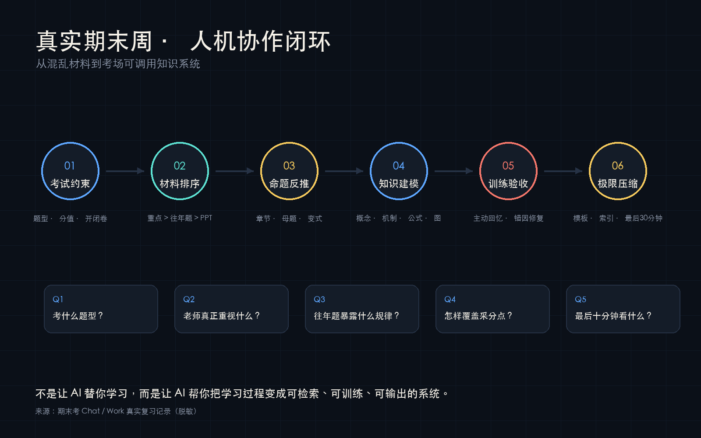
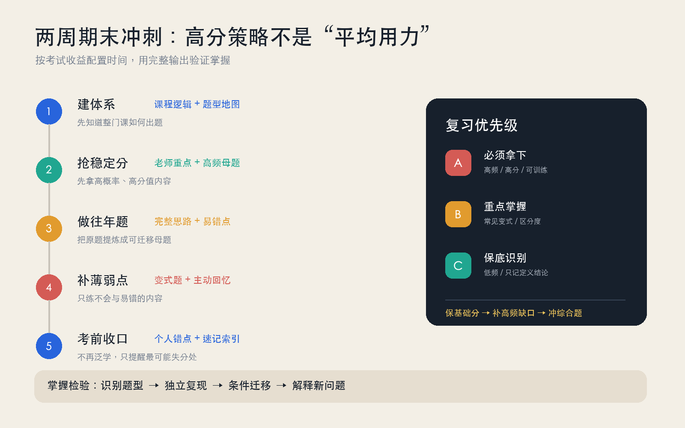

# 真实期末冲刺案例

> 不是虚构演示，而是一次真实的人机协作复习过程的公开安全版本。

本目录复盘了一名中国大学生在约两周期末周内，使用 AI 处理课程 PPT、老师重点、作业题和往年题，并将材料转化为知识框架、答题模板、开卷索引和考前速记的过程。用户反馈多门课程取得了满意的 90+ 成绩。

这里保留真实的问题、迭代方式和生成成果，但已删除学校、教师、考场、本地文件路径等识别信息。未经授权的老师 PPT、校内往年题原文和内部资料不进入公开仓库。

## 目录

- [chat-excerpts.md](chat-excerpts.md)：真实对话摘录及其对 Skill 设计的影响。
- [review-strategy.md](review-strategy.md)：从八门考试复习经历抽象出的策略。
- [development-economics.md](subjects/development-economics.md)：开卷考试案例。
- [international-economics.md](subjects/international-economics.md)：框架、政策福利与计算题案例。
- [international-economics-study-pack.md](artifacts/international-economics-study-pack.md)：真实生成的完整复习成果样本。
- [provenance.md](provenance.md)：内容来源和可追溯性说明。
- [rights-and-redaction.md](rights-and-redaction.md)：公开发布边界与待授权材料。
- `visuals/`：人机协作闭环和两周期末冲刺策略图。

## 这次协作如何改变了 Skill

最初需求常常是“帮我整理重点”。真实使用后，用户明确提出五个必须完成的阶段：

1. 依据本学期 PPT 建立可直接上考场的知识体系；
2. 按老师重点和分值收益安排二轮复习；
3. 完整做完往年题并写出详细思路；
4. 针对不会的高分题型生成变式训练；
5. 在考前半小时根据全部对话生成个性化提醒。

这五步后来成为 `five-stage-workflow` 分支的核心。

## 视觉复盘

## 案例的使用方式

这些材料不是“标准答案库”，而是帮助维护者判断：

- 用户在高压场景中真正需要什么；
- AI 的第一次输出为什么经常“不够能上考场”；
- 如何从用户反馈中迭代 Skill；
- 如何在应试效率与长期理解之间保持平衡；
- 如何公开真实案例，同时尊重教师版权和学生隐私。

## 成绩声明

90+ 为用户对个人考试结果的自述，仅用于说明该流程经过真实场景使用，不代表成绩保证，也不能证明单一工具与成绩之间存在因果关系。
